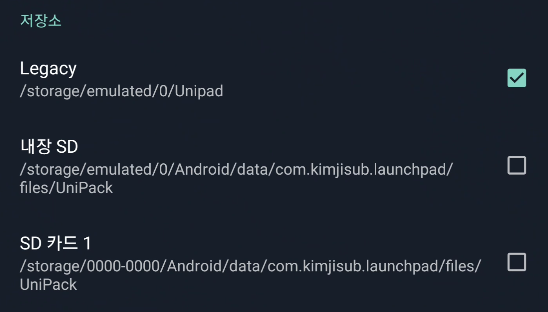

Android 10 정책 변경으로 인해 UniPad 4.0.0 에서 저장소 관련 변경사항이 있습니다.

<!--truncate-->

## 이전 버전

이전 버전의 유니패드에서는 공용 저장소 공간인 `/storage/emulated/0/Unipad` 에 유니팩을 저장하여 서드파티 앱을 통해서 유니팩에 접근할 수 있었습니다. 하지만 Android 10 정책 변경으로 인하여 특수한 권한 없이는 해당 위치에 접근이 불가능하게 되었고, 그동안 최신 버전의 안드로이드 기기에서는 유니패드 사용이 불가능하던 문제가 있었습니다.

## 업데이트 내용

이에 따라 공용 저장소가 아닌 앱 내부 저장소로 유니팩 저장 경로를 수정하였습니다.

## 개발자의 고찰

아래 내용은 개발자들을 위한 내용입니다.

Android 10의 Scoped Storage를 지원하기 위해서 했던 여러가지 시도들을 했습니다.

### 1. 